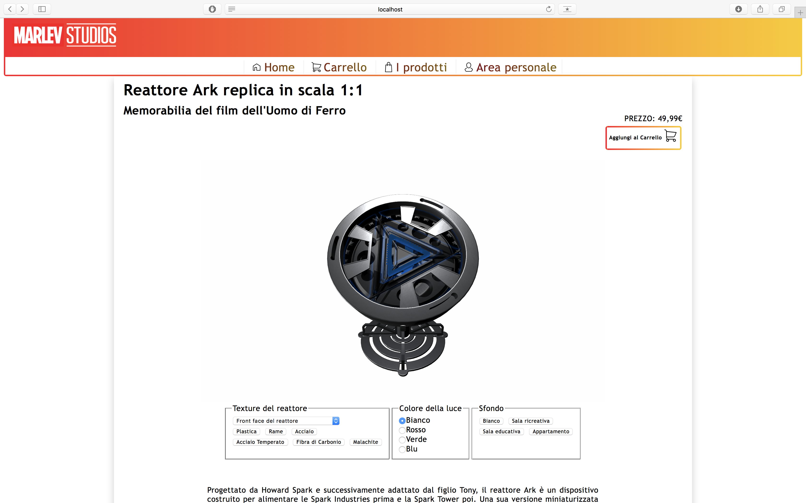
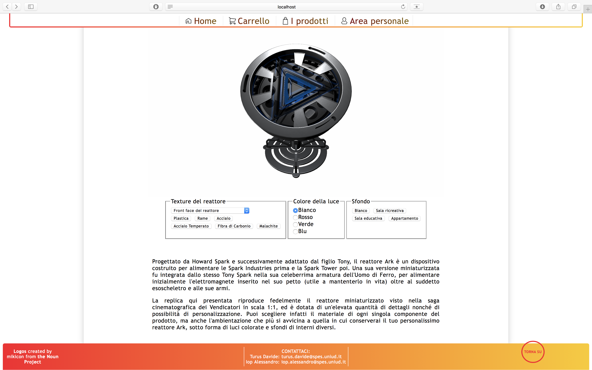
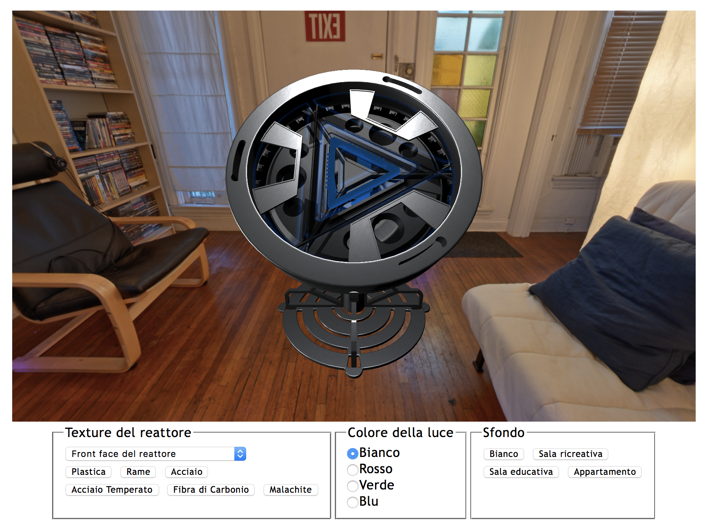
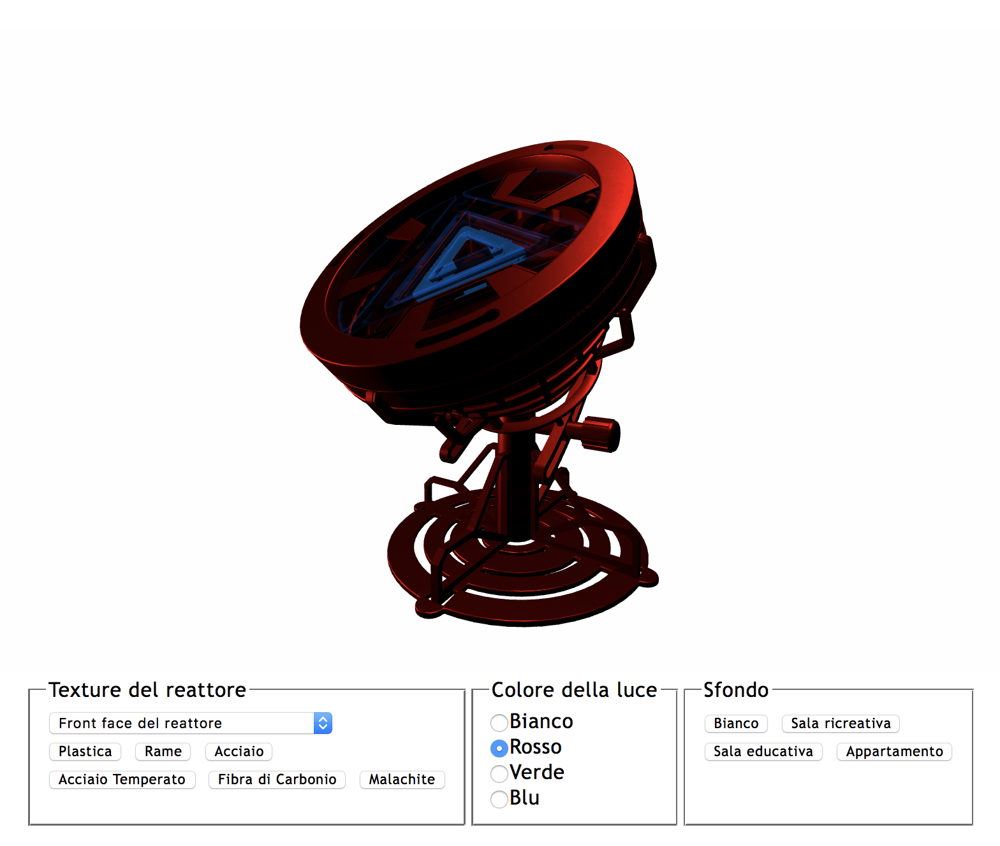
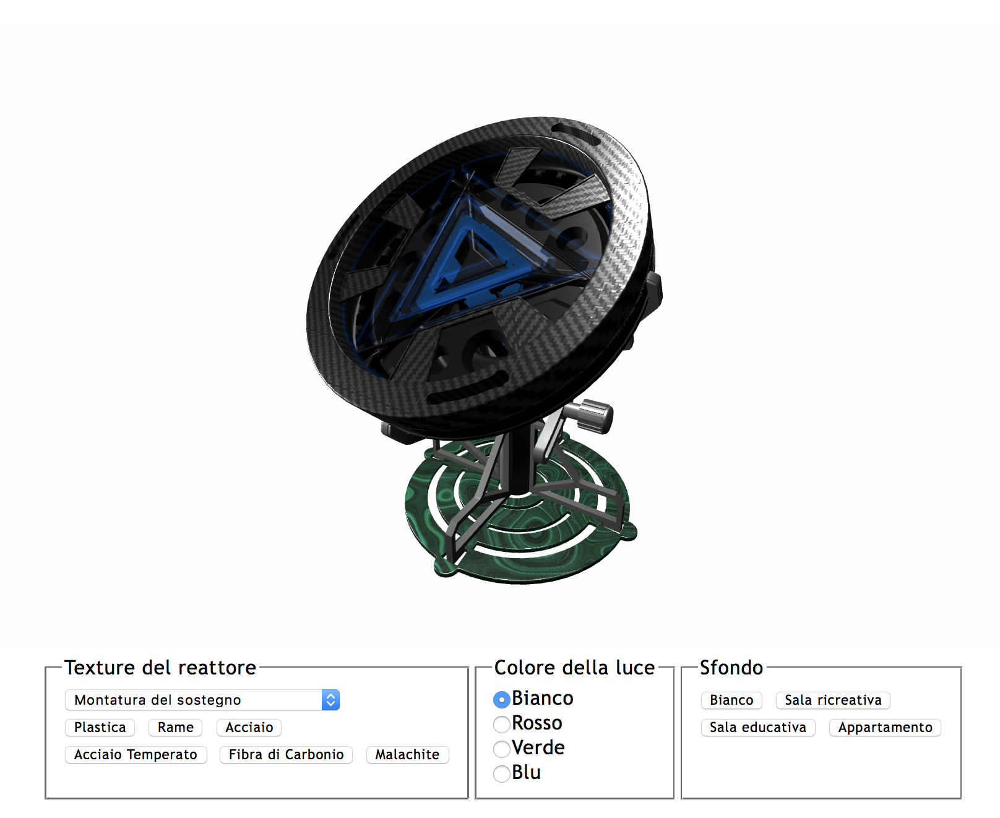
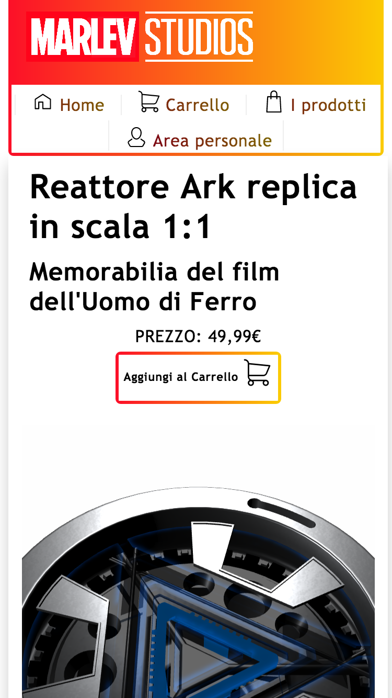

# REPORT DI PROGETTO - Turus Davide, Iop Alessandro
## Descrizione generale
Il progetto presentato consiste nella simulazione di una pagina di un sito di e-commerce specializzato nella vendita di memorabilia legata ai film dell'Universo Cinematografico Marvel. Nello specifico, si tratta della pagina web di acquisto di una replica fedele del reattore Arc indossato da IronMan e facente parte della sua armatura, poggiante su un sostegno apposito e personalizzabile nelle texture di alcune sue componenti oltre al colore della luce che lo illumina e allo sfondo della scena. Si tratta quindi di una simulazione, regolabile dal visitatore del sito mediante un'interfaccia apposita, dell'aspetto che il prodotto avrebbe se collocato in una specifica ambientazione d'interno, realizzato con specifici materiali e illuminato con una specifica luce. 
La pagina web presentata è completa in tutte le sue parti; ognuno dei link già pronto a indirizzare ad apposite pagine/sezioni del sito (basta dare un valore alternativo a *#* nei rispettivi attributi *src*), nel footer sono presenti i contatti di chi gestisce il sito nonché i credits per i loghi utilizzati come icone, e nel corpo principale è stata fornita una breve descrizione del prodotto in vendita per garantire una verosimiglianza con i siti di commercio online più diffusi. È da notare che la pagina web è completamente responsive, e sono stati implementati in essa un menù "sticky" (che si aggancia alla sommità del viewport una volta che si scorre in basso) oltre a un comodo pulsante "torna su" per tornare alla visualizzazione del titolo principale. 
Il progetto è stato implementato in un unico file, *index.html*, corredato da un file *index.css* esterno. Le librerie di three.js sono prese dalla directory *lib*, mentre il modello 3d del reattore è preso dalla directory *models*, le immagini dalla directory *images* e le texture dalla directory *textures*. Per quanto riguarda il layout della pagina, l'ispirazione è venuta dalla conoscenza personale di altri siti di e-commerce, come Amazon, così come i contenuti della stessa (voci del menù, footer, descrizione del prodotto...); per la decisione del prodotto da "pubblicizzare" invece, abbiamo optato per un oggetto con un numero relativamente limitato di vertici (sono 50.000) e scomponibile in diverse parti, per migliorare il servizio di personalizzazione che avremmo offerto. Queste due parti del progetto sono state sviluppate separatamente, per un lavoro più efficiente dei membri del gruppo senza causare intralci e perdere tempo: dopo che la pagina web e il modello 3d erano stati prodotti e testati in file separati, sono stati integrati in un unico file. 
Per poter visualizzare il modello 3d è necessario aprire la pagina da un web server locale, in quanto per il caricamento delle varie risorse ad esso legate (cioè ai file esterni sopra citati) è necessario l'accesso al file system, cosa non sempre permessa dai browser.

## Risultati
||
|:--:|
|*Vista iniziale della pagina web (Safari)*|

||
|:--:|
|*Vista del footer, del menù "sticky" e del bottone "torna su" (Safari)*|

||
|:--:|
|*Visualizzazione del modello 3d con ambientazione alternativa (appartamento)*|

||
|:--:|
|*Visualizzazione del modello 3d con colore della luce alternativo (rosso)*|

||
|:--:|
|*Visualizzazione del modello 3d con texture diverse per le diverse componenti*|

||
|:--:|
|*Visualizzazione della responsiveness della pagina web (iPhone 6s)*|

## Processo di sviluppo
Il processo di sviluppo è elencato nei dettagli all'interno del [journal](journal.md) di progetto, di seguito ne sono riportati i passi principali:
1. 

## Credits
La nostra intenzione era quella di violare il meno possibile clausole di copyright attribuibili a nomi importanti e famosi come quelli collegabili all'Universo Cinematografico Marvel, quindi abbiamo adottato un approccio prudente e modificato tutti i nomi propri ad esso legati in modo che se ne conservasse comunque il significato. Ne derivano di conseguenza traduzioni come "l'Uomo di Ferro" e "reattore Ark".
- Per le icone ci siamo affidati al sito [The Noun Project](https://thenounproject.com), in particolare a quelle create da [Mikicon](https://thenounproject.com/mikicon/collection/e-commerce-2/).
- Per le texture prive di licenza ci siamo affidati al sito [Allegorithmic Share](https://share.allegorithmic.com).
- Per il modello del reattore Arc ci siamo affidati al sito Sketchfab, e in particolare il modello è quello realizzato da [Chris Kuhn](https://sketchfab.com/models/0e826ad87cf84681ac1f0df2b7ea88c3).
- Per alcune texture ci siamo anche affidati a [Blender](https://www.blender.org).